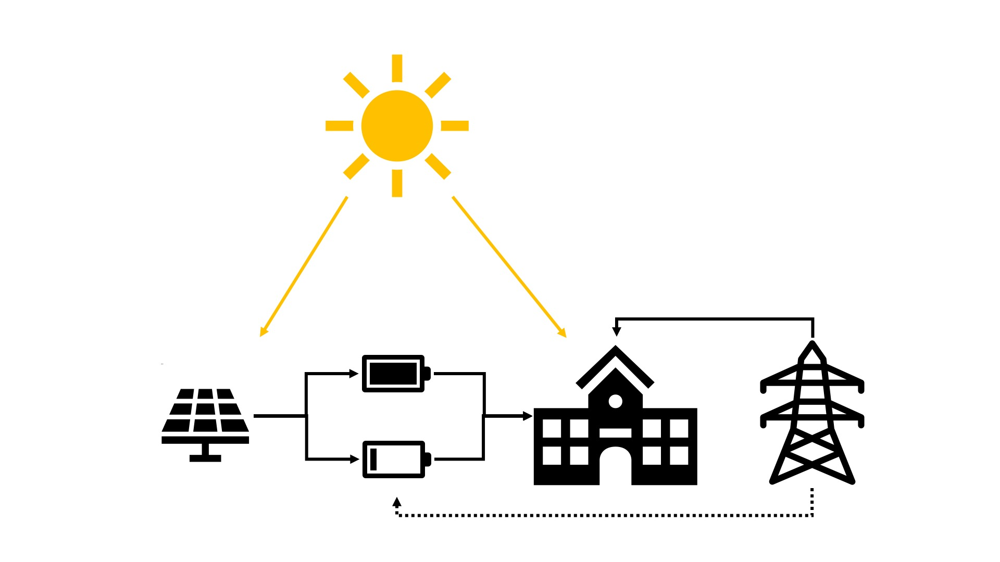

# Renewable Energy and Storage Optimization

## Problem
A univeristy building is going to hold classes for a week, which requires electricity to run. and the demand for electricity changes due to the course load. There is a solar panel to provide energy and two batteries that can store it. Additionally, electricity can be purchased from the gird. The goal of the problem is to find the battery charge and discharge schedule that will:
1. Minimize the total electrity purchased from the grid.
2. Given electrity prices for each period, minimize the total cost of purchasing electricity from the grid. 

. 
 
## Beware Spoilers!
We also put **completed** versions of the  notebook in the repo. If you want to work through the notebook without everything filled in make sure not to open that version. 
